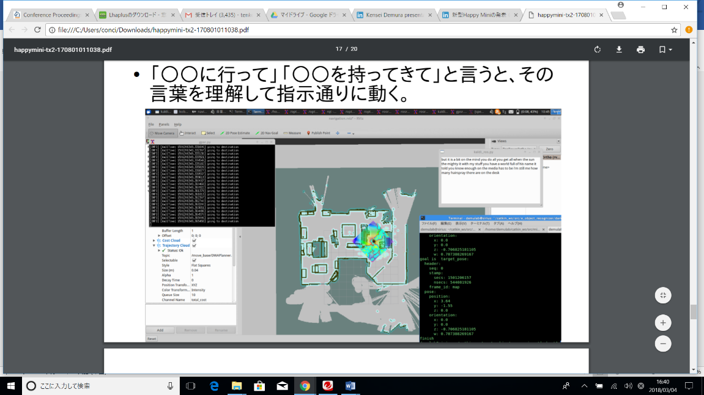
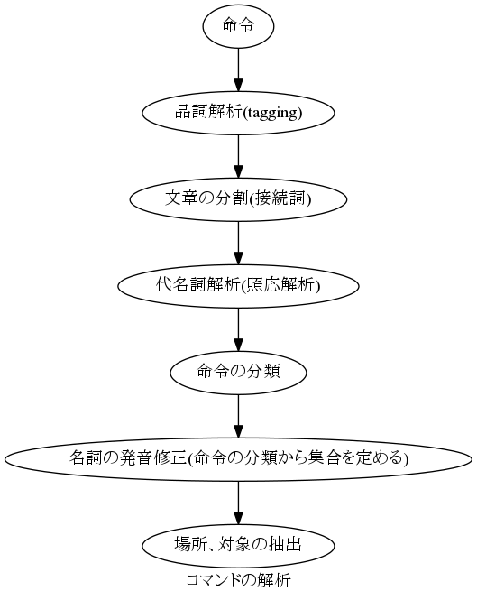

# GPSR

Source code used for GPSR Challenge at RoboCup 2015-2017@home

## Docs  

## Library
scripts/CommandAnalyzer.py have library functionality. Include to your project to use it.   

## Dependencies  
nltk  
1. Brown Corpus  
2. WordNet  
3. CMUDict  
4. Tagger  

[nlpnet](https://github.com/erickrf/nlpnet)  
kaldi_ros
NGram

