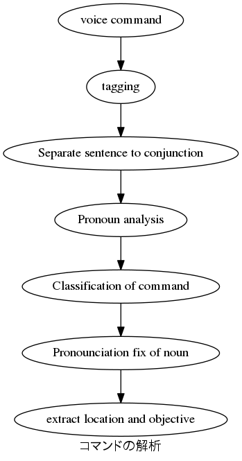

# GPSR

Source code used for GPSR Challenge at RoboCup 2015-2017@home

## Docs  

1. Voice Command  
We are using Kaldi speech engine.  

2. Tagging  
nltk default perceptron tagger had poor performance. We used Two-step Convolutional Neural Network to overcome this problem.    

3. Normalization
Convert polite expression, and conjuction to normal, and separated sentence for normalization.   

4. Classification of command
Classify the command to "deliver", "grasp", "follow", "answer", "search", "move, "manipulation" categories.  
  
5. Pronounciation fix of noun  
For understanding non-native speaker speech, we used CMUDict + Ngram for word similarity matching and search for word candidate.  

6. Extract location and objective  
Extract location and ojective by the five sentence structures of English grammer.  

## Library
scripts/CommandAnalyzer.py have library functionality. Include to your project to use it.   

## Dependencies  
nltk  
1. Brown Corpus  
2. WordNet  
3. CMUDict  
4. Tagger  

[nlpnet](https://github.com/erickrf/nlpnet)  
kaldi_ros  
NGram

